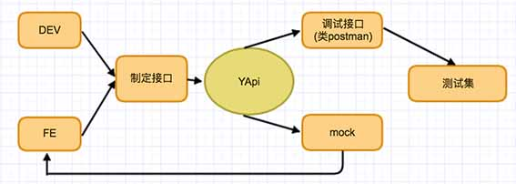

## YApi（社区 fork 维护版）

本仓库 fork 自 [YApi](https://github.com/YMFE/yapi) / YApi Pro，原作者已停止维护。
本 fork 在原有功能基础上做兼容性修复，并提供开箱即用的 Docker Compose 部署方案。

> 说明：原 YApi Pro 的在线版（yapi.pro）、官方 Docker 镜像（yapipro/yapi）、
> `yapi-pro-cli` 命令行升级机制、官方交流群等均由原作者运营，**与本 fork 无关，已不再适用**。
> 本 fork 仅以本仓库源码 + Docker Compose 方式部署和升级。

### 最近更新
**v1.11.2** (2026-07-06)
1. 登录页支持通行密钥 Conditional UI 自动填充
2. 密码登录前优先尝试通行密钥，取消后可继续密码登录
3. 密码登录二次验证改为手动获取邮件验证码，不再首次 406 时自动发信
4. 邮件验证码重发增加 60 秒倒计时

**v1.11.1** (2026-07-06)
1. 修复已绑通行密钥账号密码登录时邮件验证码输入框不显示

**v1.11.0** (2026-07-06)
1. 支持 WebAuthn 通行密钥（Passkey）：个人中心绑定/删除，登录页一键登录
2. 已绑定通行密钥的账号，在启用 `mail` 时密码登录需邮件验证码二次确认
3. 新增 `config.json` 的 `passkey` 配置项（见下方「通行密钥配置」）

**v1.10.2** (2026-06-16)
1. 修复 Ace Editor worker 在 SPA 路由下加载失败，恢复 JSON/JS 语法校验

**v1.10.0** (2026-06-13)
1. 前端构建从 ykit 迁移至 Vite，升级 Vite 至 v7、Vitest 至 v4
2. 单元测试迁移至 Vitest，新增 GitHub Actions CI
3. 升级 Node 20 / Koa 3 / Mongoose 6 / ajv v8 等核心依赖
4. 重写部署升级文档，修复 Docker config.json 加载
5. GitHub Actions 自动构建并推送多架构（amd64/arm64）Docker 镜像到 [GHCR](https://github.com/darknessomi/yapi/pkgs/container/yapi)（`ghcr.io/darknessomi/yapi`），支持 `latest` / 语义化版本 / 分支标签

## YApi 可视化接口管理平台

YApi 是<strong>高效</strong>、<strong>易用</strong>、<strong>功能强大</strong>的 api 管理平台，旨在为开发、产品、测试人员提供更优雅的接口管理服务。可以帮助开发者轻松创建、发布、维护 API，YApi 还为用户提供了优秀的交互体验，开发人员只需利用平台提供的接口数据写入工具以及简单的点击操作就可以实现接口的管理。

文档（原作者，仅供功能参考）：
<p><a target="_blank" href="https://hellosean1025.github.io/yapi">hellosean1025.github.io/yapi</a></p>

### 平台介绍


### 特性
*  基于 Json5 和 Mockjs 定义接口返回数据的结构和文档，效率提升多倍
*  扁平化权限设计，即保证了大型企业级项目的管理，又保证了易用性
*  类似 postman 的接口调试
*  自动化测试, 支持对 Response 断言
*  MockServer 除支持普通的随机 mock 外，还增加了 Mock 期望功能，根据设置的请求过滤规则，返回期望数据
*  支持 postman, har, swagger 数据导入
*  免费开源，内网部署，信息再也不怕泄露了

## 部署（推荐：Docker Compose）

本仓库已内置预编译前端（`static/prd`），无需单独构建前端即可运行。

### 环境要求
* Docker
* Docker Compose

### 安装与启动

**方式一：拉取预编译镜像（推荐）**

[docker-compose.yml](docker-compose.yml) 使用 GHCR 预编译镜像，无需本地构建：

```bash
docker compose up -d

# 访问 http://127.0.0.1:3000
```

镜像地址：[ghcr.io/darknessomi/yapi](https://github.com/darknessomi/yapi/pkgs/container/yapi)，可用 tag 包括 `latest`、`1.11.0`、`1.10` 等，支持 `linux/amd64` 与 `linux/arm64`。如需固定版本，将 `docker-compose.yml` 中的 `:latest` 改为具体 tag。

**方式二：本地源码构建**

如需从源码自行构建镜像，使用 [docker-compose.build.yml](docker-compose.build.yml)：

```bash
# 首次约 4 分钟；仅改业务代码时 rebuild 约数秒
docker compose -f docker-compose.build.yml up -d --build

# 访问 http://127.0.0.1:3000
```

首次启动会自动初始化数据库并创建管理员账号（由 `docker/start.sh` 完成，通过 `init.lock` 保证只初始化一次）。

默认管理员账号：

- 邮箱：`admin@admin.com`
- 密码：`yapi.pro`（登录后可在个人中心修改）

### 服务管理

```bash
docker compose logs -f yapi        # 查看日志
docker compose restart yapi        # 重启服务
docker compose stop                # 停止服务
docker compose down                # 停止并移除容器（保留数据）
docker compose down -v             # 停止并清除 MongoDB 数据（慎用）
```

### 升级

升级不会影响已有数据（数据存于 `mongo-data` 数据卷）。

**预编译镜像方式（推荐）：**

```bash
docker compose pull yapi           # 拉取最新镜像
docker compose up -d yapi          # 重启服务
```

**本地源码构建方式：**

```bash
git pull                                                      # 拉取本仓库最新代码
docker compose -f docker-compose.build.yml up -d --build yapi # 重新构建并启动
```

### 配置

配置文件位于 `docker/config.json`（以只读方式挂载到容器内 `/yapi/config.json`），可按需修改端口、数据库连接、邮件、通行密钥等。修改后执行 `docker compose up -d yapi` 重启生效（无需 rebuild）。

源码部署时，在项目根目录创建 `config.json`（可参考 `config_example.json`）。

```json
{
  "port": "3000",
  "adminAccount": "admin@admin.com",
  "timeout": 120000,
  "db": {
    "servername": "mongo",
    "DATABASE": "yapi",
    "port": 27017
  },
  "mail": { "enable": false },
  "passkey": {
    "rpName": "YApi",
    "rpID": "yapi.example.com",
    "origin": "https://yapi.example.com"
  }
}
```

#### 通行密钥配置（`passkey`）

v1.11.0 起支持 WebAuthn 通行密钥。生产环境**必须**显式配置 `passkey`，且站点须通过 **HTTPS** 访问（本地开发可用 `http://localhost` 或 `http://127.0.0.1`）。

| 字段 | 说明 |
|------|------|
| `rpName` | 注册时展示给用户的名称，默认 `YApi` |
| `rpID` | Relying Party ID，须为访问域名的主机名（不含端口），如 `yapi.example.com` |
| `origin` | 浏览器实际访问的完整来源，如 `https://yapi.example.com`；须与 `rpID`、协议一致 |

未配置时，服务端会尝试从请求头自动推断 `rpID` 与 `origin`；反向代理或非标端口场景下容易校验失败，建议始终写死。

**本地开发示例**（`config.json` 或 `docker/config.json`）：

```json
"passkey": {
  "rpName": "YApi",
  "rpID": "localhost",
  "origin": "http://localhost:3000"
}
```

**反向代理示例**（Nginx 将 `https://yapi.example.com` 转发到容器 3000 端口）：

```json
"passkey": {
  "rpName": "YApi",
  "rpID": "yapi.example.com",
  "origin": "https://yapi.example.com"
}
```

**与密码登录的关系**：用户在个人中心绑定通行密钥后，仍可使用密码登录。若已启用 `mail` 并完成 SMTP 配置，密码登录需先通过邮件验证码二次确认；未启用邮件时，密码登录不受通行密钥绑定影响。

## 从旧版升级到本 fork

如果你之前用 **原版 YApi / YApi Pro**（无论是 `yapi-pro-cli` 部署，还是原作者的 Docker 镜像）安装过，迁移到本 fork 时**数据不需要做任何转换**：YApi 的所有项目、接口、用户数据都存在 MongoDB 中，本 fork 与旧版的数据结构兼容（`server/install.js` 只创建管理员和索引，不修改业务数据）。升级本质上只是**用本 fork 的代码连接到你原来的 MongoDB**。

> ⚠️ 操作前务必备份数据库：`mongodump --db yapi --out ./yapi-backup`

### 方式一：源码替换（适合 yapi-pro-cli / pm2 部署）

```bash
# 1. 停掉旧服务
pm2 stop yapi          # 或停止你原来的启动方式

# 2. 用本 fork 的代码替换旧的运行目录（旧版代码在部署目录的 vendors/ 下）
#    建议直接 clone 本仓库到新目录运行，避免污染旧目录

# 3. 准备 config.json，db 指向你原来的 MongoDB（地址/端口/库名保持和旧版一致）

# 4. 安装依赖（不要再执行 node server/install.js，数据库已初始化过）
npm install

# 5. 启动
node server/app.js     # 或 pm2 start server/app.js --name yapi
```

要点：**不要重新跑 `install.js`**，否则会因管理员邮箱唯一索引冲突而报错；旧库里已有数据，直接启动即可。

### 方式二：切换到本 fork 的 Docker Compose

本仓库自带的 `docker-compose.yml` 会启动一个**全新的空 MongoDB**（`mongo-data` 数据卷）。要复用旧数据，二选一：

**A. 直接连接旧的外部 MongoDB（旧库不在容器里时最简单）**

修改 `docker/config.json`，把 `db.servername` / `port` / `DATABASE` 指向你现有的 MongoDB（例如宿主机 `host.docker.internal` 或局域网地址），并删除 `docker-compose.yml` 中的 `mongo` 服务及 `depends_on`，然后：

```bash
docker compose up -d yapi
```

`docker/start.sh` 会先尝试 `install.js`，因管理员已存在而失败后，自动检测到旧管理员账号存在，跳过初始化并正常启动——所以连旧库不会重复初始化数据。

**B. 把旧数据导入本 fork 的 MongoDB 容器**

```bash
# 旧库导出
mongodump --uri "mongodb://<旧地址>:27017/yapi" --out ./yapi-backup

# 启动本 fork（先用自带 mongo 服务）
docker compose up -d

# 导入到容器内的 mongo
docker compose cp ./yapi-backup yapi-mongo-1:/tmp/yapi-backup
docker compose exec mongo mongorestore --db yapi /tmp/yapi-backup/yapi
```

导入完成后重启 yapi 服务即可：`docker compose restart yapi`。

### 升级后的账号密码

数据复用后，登录账号和密码**沿用你旧库里的设置**，不会被重置为默认值。

## 源码部署（进阶）

如需脱离 Docker 直接在主机运行：

### 环境要求
* Node.js 20+（见 `package.json` 的 `engines`）
* MongoDB 6+
* git

### 步骤

```bash
# 1. 安装依赖
npm install

# 2. 准备 config.json（参考 docker/config.json，将 db.servername 改为本机 MongoDB 地址，如 127.0.0.1）

# 3. 初始化数据库（仅首次）
node server/install.js

# 4. 启动服务
node server/app.js
# 或使用 npm start
```

前端使用 Vite 构建。开发时双端口运行：Koa 后端 + Vite 前端（`:4000`）。

```bash
# 终端 1：后端（dev 模式使用 static/dev.html）
npm run dev-server

# 终端 2：前端 Vite dev server
npm run dev-client

# 浏览器访问 http://127.0.0.1:3000
```

生产构建：

```bash
npm run build-client   # 产物输出到 static/prd
```

### 使用 pm2 管理进程

```bash
npm install -g pm2
pm2 start server/app.js --name yapi
pm2 info yapi      # 查看服务信息
pm2 restart yapi   # 重启服务
pm2 stop yapi      # 停止服务
```

### 教程（原作者，仅供功能参考）
* [使用 YApi 管理 API 文档，测试， mock](https://juejin.im/post/5acc879f6fb9a028c42e8822)
* [自动更新 Swagger 接口数据到 YApi 平台](https://juejin.im/post/5af500e251882567096140dd)
* [自动化测试](https://juejin.im/post/5a388892f265da430e4f4681)

### YApi 插件
* [yapi sso 登录插件](https://github.com/YMFE/yapi-plugin-qsso)
* [yapi cas 登录插件](https://github.com/wsfe/yapi-plugin-cas) By wsfe
* [yapi gitlab集成插件](https://github.com/cyj0122/yapi-plugin-gitlab)
* [oauth2.0登录](https://github.com/xwxsee2014/yapi-plugin-oauth2)
* [rap平台数据导入](https://github.com/wxxcarl/yapi-plugin-import-rap)
* [dingding](https://github.com/zgs225/yapi-plugin-dding) 钉钉机器人推送插件
* [export-docx-data](https://github.com/inceptiongt/Yapi-plugin-export-docx-data) 数据导出docx文档
* [interface-oauth-token](https://github.com/shouldnotappearcalm/yapi-plugin-interface-oauth2-token) 定时自动获取鉴权token的插件
* [import-swagger-customize](https://github.com/follow-my-heart/yapi-plugin-import-swagger-customize) 导入指定swagger接口

### 代码生成
* [yapi-to-typescript：根据 YApi 的接口定义生成 TypeScript 的请求函数](https://github.com/fjc0k/yapi-to-typescript)
* [yapi-gen-js-code: 根据 YApi 的接口定义生成 javascript 的请求函数](https://github.com/hellosean1025/yapi-gen-js-code)

### YApi 一些工具
* [Api Generator](https://github.com/Forgus/api-generator) 接口文档自动生成插件（零入侵）
* [mysql服务http工具,可配合做自动化测试](https://github.com/hellosean1025/http-mysql-server)
* [idea 一键上传接口到yapi插件](https://github.com/diwand/YapiIdeaUploadPlugin)
* [idea 接口上传调试插件 easy-yapi](https://easyyapi.com/)
* [执行 postgres sql 的服务](https://github.com/shouldnotappearcalm/http-postgres-server)

### Authors（原项目）
* [hellosean1025](https://github.com/hellosean1025)
* [gaoxiaomumu](https://github.com/gaoxiaomumu)
* [zwjamnsss](https://github.com/amnsss)
* [dwb1994](https://github.com/dwb1994)
* [fungezi](https://github.com/fungezi)

### License
Apache License 2.0
