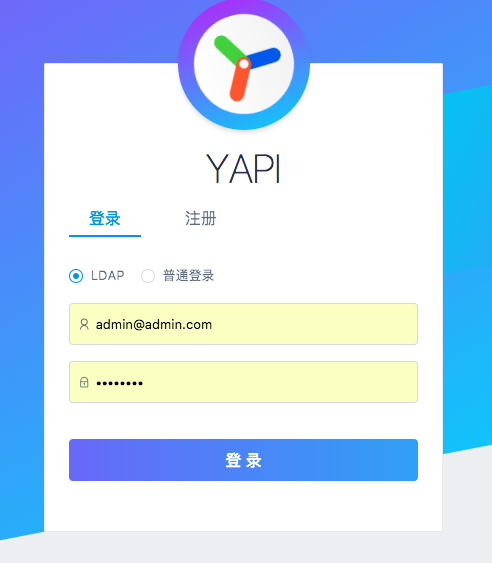

# 内网部署

本 fork 推荐使用 [Docker Compose](https://github.com/darknessomi/yapi#部署推荐docker-compose) 部署，详见仓库 [README](https://github.com/darknessomi/yapi)。

> 说明：原 YApi Pro 的 `yapi-pro-cli` 可视化部署、官方 Docker 镜像（yapipro/yapi）等**与本 fork 无关，已不再适用**。本 fork 通过 GHCR 预编译镜像、Docker Compose 本地构建或源码方式部署和升级。

建议部署成 http 站点，因 Chrome 浏览器安全限制，部署成 https 会导致测试功能在请求 http 站点时文件上传功能异常。

如果您是将服务器代理到 nginx 服务器，请配置 nginx 支持 websocket。

```
在location /添加
proxy_http_version 1.1;
proxy_set_header Upgrade $http_upgrade;
proxy_set_header Connection "upgrade";
```

## 环境要求

* Docker + Docker Compose（推荐）
* 或 Node.js 20+、MongoDB 6+、git（源码部署）

## 安装

### 方式一. Docker Compose 部署（推荐）

**拉取预编译镜像（推荐）**

[docker-compose.yml](https://github.com/darknessomi/yapi/blob/master/docker-compose.yml) 使用 [GHCR 预编译镜像](https://github.com/darknessomi/yapi/pkgs/container/yapi)（`ghcr.io/darknessomi/yapi`），无需本地构建：

```bash
git clone https://github.com/darknessomi/yapi.git
cd yapi
docker compose up -d
# 访问 http://127.0.0.1:3000
```

可用 tag 包括 `latest`、`1.10`、`1.10.1` 等，支持 `linux/amd64` 与 `linux/arm64`。如需固定版本，将 `docker-compose.yml` 中的 `:latest` 改为具体 tag。

**本地源码构建**

如需从源码自行构建镜像，使用 [docker-compose.build.yml](https://github.com/darknessomi/yapi/blob/master/docker-compose.build.yml)：

```bash
git clone https://github.com/darknessomi/yapi.git
cd yapi
docker compose -f docker-compose.build.yml up -d --build
# 访问 http://127.0.0.1:3000
```

首次启动会自动初始化数据库并创建管理员账号。默认管理员：邮箱 `admin@admin.com`，密码 `yapi.pro`（登录后可在个人中心修改）。

详细说明见仓库 [README — 部署](https://github.com/darknessomi/yapi#部署推荐docker-compose)。

### 方式二. 源码部署

```bash
git clone https://github.com/darknessomi/yapi.git
cd yapi
npm install
cp config_example.json config.json   # 复制后修改 MongoDB 等配置
node server/install.js                 # 仅首次初始化
node server/app.js
```

生产环境需先构建前端：

```bash
npm run build-client   # 产物输出到 static/prd
node server/app.js
```

## 服务器管理

推荐使用 pm2 管理 node 服务器启动、停止，具体使用方法可参考下面的教程：

* <a href="http://pm2.keymetrics.io/docs/usage/quick-start/" target="_blank">官网文档</a>
* <a href="http://imweb.io/topic/57c8cbb27f226f687b365636" target="_blank">PM2实用入门指南</a>

## 升级

**Docker Compose（预编译镜像，推荐）：**

```bash
docker compose pull yapi
docker compose up -d yapi
```

**Docker Compose（本地源码构建）：**

```bash
git pull
docker compose -f docker-compose.build.yml up -d --build yapi
```

**源码 / pm2：**

```bash
git pull
npm install
npm run build-client   # 若前端有变更
pm2 restart yapi
```

从旧版 YApi / YApi Pro 迁移说明见仓库 [README — 从旧版升级到本 fork](https://github.com/darknessomi/yapi#从旧版升级到本-fork)。

## 配置邮箱
打开项目目录 config.json 文件（Docker Compose 部署时为 `docker/config.json`），新增 mail 配置， 替换默认的邮箱配置
```json
{
  "port": "*****",
  "adminAccount": "********",
  "db": {...},
  "mail": {
    "enable": true,
    "host": "smtp.163.com",    //邮箱服务器
    "port": 465,               //端口
    "from": "***@163.com",     //发送人邮箱
    "auth": {
        "user": "***@163.com", //邮箱服务器账号
        "pass": "*****"        //邮箱服务器密码
    }
  }
}
```
如何申请STMP服务器账号和密码可以参考下面的教程：<a href="https://jingyan.baidu.com/article/fdbd42771da9b0b89e3f48a8.html" target="_blank">如何开通电子邮箱的SMTP功能</a>

Docker Compose 部署修改配置后，执行 `docker compose up -d yapi` 重启生效（无需 rebuild）。


## 配置LDAP登录
     
打开项目目录 config.json 文件（Docker Compose 部署时为 `docker/config.json`），添加如下字段：   

```json
{
  "port": "*****",
  "adminAccount": "********",
  "db": {...},
  "mail": {...},
  "ldapLogin": {
      "enable": true,
      "server": "ldap://l-ldapt1.com",
      "baseDn": "CN=Admin,CN=Users,DC=test,DC=com",
      "bindPassword": "password123",
      "searchDn": "OU=UserContainer,DC=test,DC=com",
      "searchStandard": "mail",    // 自定义格式： "searchStandard": "&(objectClass=user)(cn=%s)"
      "emailPostfix": "@163.com",
      "emailKey": "mail",
      "usernameKey": "name"
   }
}

```   
这里面的配置项含义如下：  

- `enable` 表示是否配置 LDAP 登录，true(支持 LDAP登录 )/false(不支持LDAP登录);
- `server ` LDAP 服务器地址，前面需要加上 ldap:// 前缀，也可以是 ldaps:// 表示是通过 SSL 连接;
- `baseDn` LDAP 服务器的登录用户名，必须是从根结点到用户节点的全路径(非必须);
- `bindPassword` 登录该 LDAP 服务器的密码(非必须);
- `searchDn` 查询用户数据的路径，类似数据库中的一张表的地址，注意这里也必须是全路径;
- `searchStandard` 查询条件，这里是 mail 表示查询用户信息是通过邮箱信息来查询的。注意，该字段信息与LDAP数据库存储数据的字段相对应，如果如果存储用户邮箱信息的字段是 email,  这里就需要修改成 email.（1.3.18+支持）自定义filter表达式，基本形式为：&(objectClass=user)(cn=%s), 其中%s会被username替换
- `emailPostfix` 登陆邮箱后缀（非必须）
- `emailKey`: ldap数据库存放邮箱信息的字段（v1.3.21 新增 非必须）
- `usernameKey`: ldap数据库存放用户名信息的字段（v1.3.21 新增 非必须）


重启服务器后，可以在登录页看到如下画面，说明 ldap 配置成功（Docker Compose 部署：`docker compose up -d yapi`）。




## 配置通行密钥（Passkey）

（v1.11.0+ 增加）在 config.json 添加 `passkey` 配置项，用于 WebAuthn 通行密钥注册与登录。Docker Compose 部署时修改 `docker/config.json`。

生产环境须通过 **HTTPS** 访问，且 `origin` 须为浏览器实际访问的完整地址（含协议，非默认端口须带端口）；`rpID` 仅填主机名（不含协议和端口）。

```json
{
  "port": "*****",
  "adminAccount": "********",
  "db": {...},
  "mail": {...},
  "passkey": {
    "rpName": "YApi",
    "rpID": "yapi.example.com",
    "origin": "https://yapi.example.com"
  }
}
```

本地 Docker Compose 默认示例（访问 `http://localhost:3000`）：

```json
"passkey": {
  "rpName": "YApi",
  "rpID": "localhost",
  "origin": "http://localhost:3000"
}
```

若通过 `http://127.0.0.1:3000` 访问，须将 `origin` 改为 `http://127.0.0.1:3000`，`rpID` 改为 `127.0.0.1`。

已绑定通行密钥的账号，在启用 `mail` 时密码登录需邮件验证码二次确认；未启用邮件时密码登录不受影响。

修改完成后，执行 `docker compose up -d yapi` 重启生效（无需 rebuild）。


## 禁止注册
在 config.json 添加 `closeRegister:true` 配置项,就可以禁止用户注册 yapi 平台，修改完成后，请重启 yapi 服务器（Docker Compose 部署：`docker compose up -d yapi`）。

```json
{
  "port": "*****",
  "closeRegister":true
}

```

## 版本通知
（v1.3.19+ 增加）在 config.json 添加 `"versionNotify": true` 配置项，就可以开启版本通知功能，默认为 `false`，修改完成后，请重启 yapi 服务器（Docker Compose 部署：`docker compose up -d yapi`）。

```json
{
  "port": "******",
  "adminAccount": "*****",
  "versionNotify": true
}

```


### 如何配置mongodb集群

请升级到 yapi >= **1.4.0**以上版本，然后在 config.json db项，配置 connectString:

```json

{
  "port": "***",
  "db": {
    "connectString": "mongodb://127.0.0.100:8418,127.0.0.101:8418,127.0.0.102:8418/yapidb?slaveOk=true",
    "user": "******",
    "pass": "******"
  },
}

```

详细配置参考： [wiki](https://mongoosejs.com/docs/connections.html#multiple_connections)
